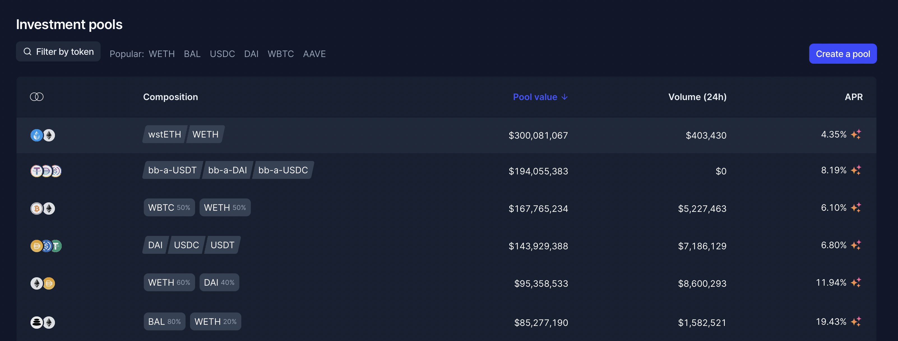

# Auction discovery page

## Purpose

The purpose of the auction discovery page is to allow users to discover auctions.

## Users

- Investor
  - Potential auction participant
- Issuer
  - Auction creator/manager

## User flows

[Investor purchases bonds from offering](../../user_flows/investors/purchase_bond_from_offering.md)

## User needs

| User     | User Wants                               | Product Needs                                     |
| -------- | ---------------------------------------- | ------------------------------------------------- |
| Investor | Wants to find auctions to participate in | Needs to display auctions in an intuitive fashion |

## Features

### [Auction lists](features/auction_list.md)

## Examples

### Balancer

### Copper Launch

### Gnosis Auction

