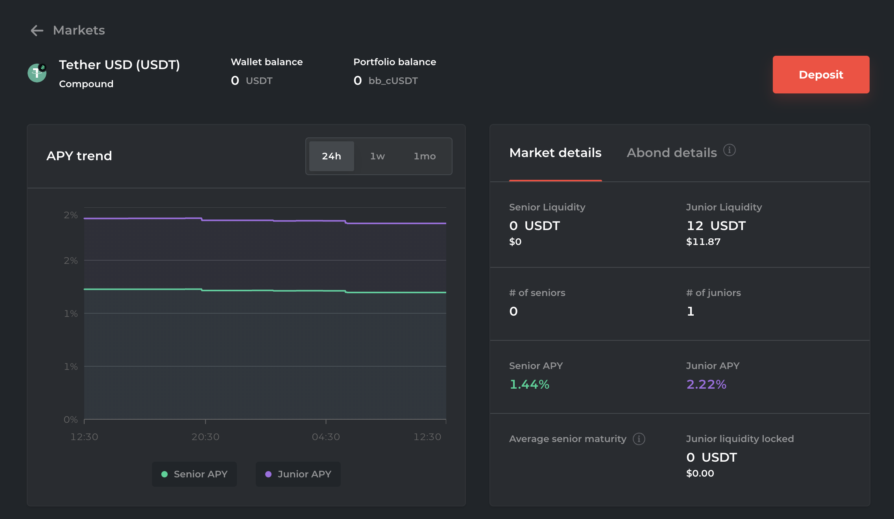

# Bond page

## Purpose

The purpose of the bond page is to enable the user to learn about and manage their bonds, including redeeming them at maturity or converting them into collateral.

## Users

- Investor
  - Past auction participant

## User flows

## User needs

| User     | User Wants                               | Product Needs                                |
| -------- | ---------------------------------------- | -------------------------------------------- |
| Investor | To redeem bonds at maturity              | Principle + interest redemption funcionality |
|          | To redeem bonds for collateral           | Collateral convertibility functionality      |
|          | To determine profitability of conversion | Display the value of convertible collateral  |
|          | To determine the value of their bonds    | Display the estimated value of bonds         |

## Features

### [Bond graph](features/bond_graph.md)

### [Bond information](features/bond_information.md)

### Link to auction

- Links to this bond's auction

### [Actions panel](features/actions_panel.md)

## Examples

### Barnbridge

