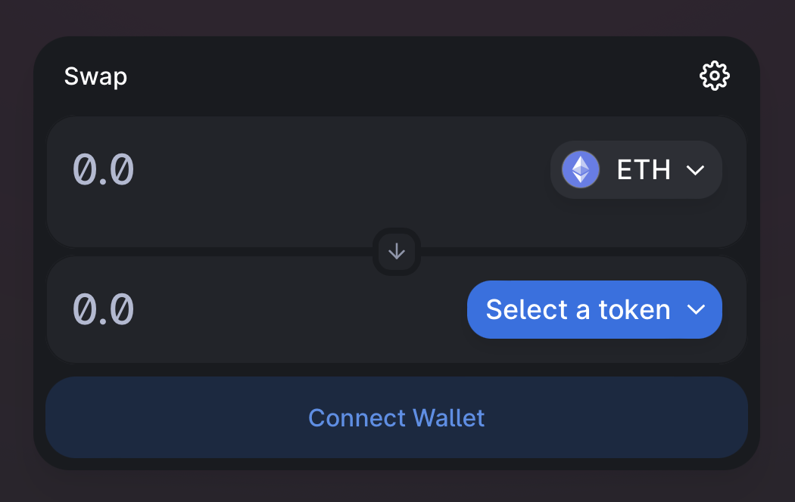

# Actions panel

## Purpose

The purpose of the actions panel is to allow users to convert their bonds into collateral or withdraw funds after bond maturity.

## States

- Before maturity
  - Convertible
    - Users can redeem bonds for portion of collateral
  - Non-convertible
    - No actions available
- After maturity
  - Convertible and Non-convertible
    - No default
      - Users can withdraw principle + interest in borrowed asset after maturity
    - Default
      - Users can withdraw principle + interest + fee in borrowed asset and collateral after maturity

## Implementation

The action panel will have a different implementation and purpose depending on the state of the auction.

### Before maturity (convertible)

#### **Convert panel**

#### Information

- Balance
  - Description: Amount of bonds in connected wallet
  - Value: number
    - Ex: 750,000 Uniswap_Mar_19_2022_USDC
- Conversion ratio
  - Description: Amount of collateral each bond is convertible to
  - Value: amount and type of asset
    - Ex: 0.5 UNI
- Conversion amount
  - Description: Amount of collateral entered amount of bonds can be convertible to. Calculate this and display it after a user has entered the "amount" input.
  - Value: amount and type of asset
    - Ex: 532 UNI

#### Inputs

- Amount
  - Description: amount of bonds to convert to collateral asset
  - Value: amount and type of asset
    - Ex: 750,000 Uniswap_Mar_19_2022_USDC (whatever this format is)
- Convert button

#### **Withdraw panel**

- Empty state

### Before maturity (non-convertible)

#### **Convert panel**

- Not shown

#### **Withdraw panel**

- Empty state

### After maturity (convertible)

#### **Convert panel**

- Empty state explaining bonds can no longer be converted

#### **Withdraw panel**

#### Information

- Balance
  - Description: Amount of bonds in connected wallet
  - Value: number
    - Ex: 750,000 Uniswap_Mar_19_2022_USDC
- Withdraw amount
  - Description: Amount of borrowed asset and collateral available to withdraw
  - Value: amount and type of assets
    - Ex: 500,640 USDC and 35 UNI

#### Inputs

- Withdraw button

### After maturity (non-convertible)

#### **Convert panel**

- Not shown

#### **Withdraw panel**

#### Information

- Balance
  - Description: Amount of bonds in connected wallet
  - Value: number
    - Ex: 750,000 Uniswap_Mar_19_2022_USDC
- Withdraw amount
  - Description: Amount of borrowed asset and collateral available to withdraw
  - Value: amount and type of assets
    - Ex: 500,640 USDC and 35 UNI

#### Inputs

- Withdraw button

## Examples

### Uniswap

