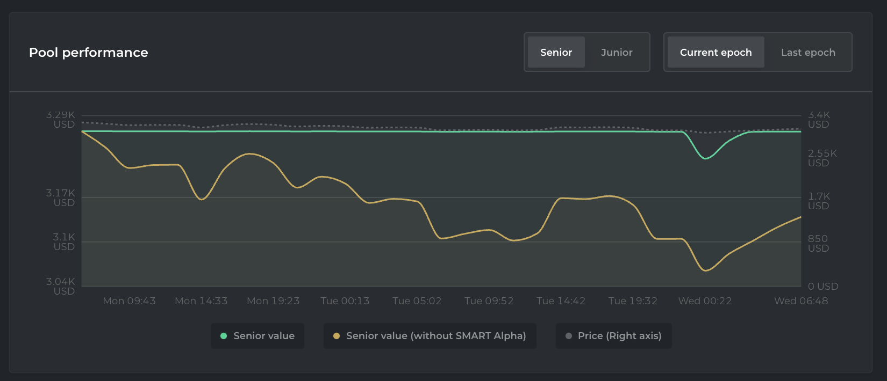

# Bond graph

## Purpose

The purpose of the pricing graph is to show the user the current and historical prices that are relevant to their bonds. It should help investors decide whether it's a good idea to convert their bonds into collateral.

## Implementation

The pricing graph will be a graph with each line representing a different piece of pricing information.

### Lines

The values are for the whole bond issuance, not just the user's bonds. The y-axis is the borrowed currency and the x-axis is time.

#### Amount owed

- Description: This line shows the number of bonds issued

#### Collateral value

- Description: This line shows the value of the collateral

#### Convertible collateral value

- Description: This line shows the convertible collateral value

## Examples

### Barnbridge

 
