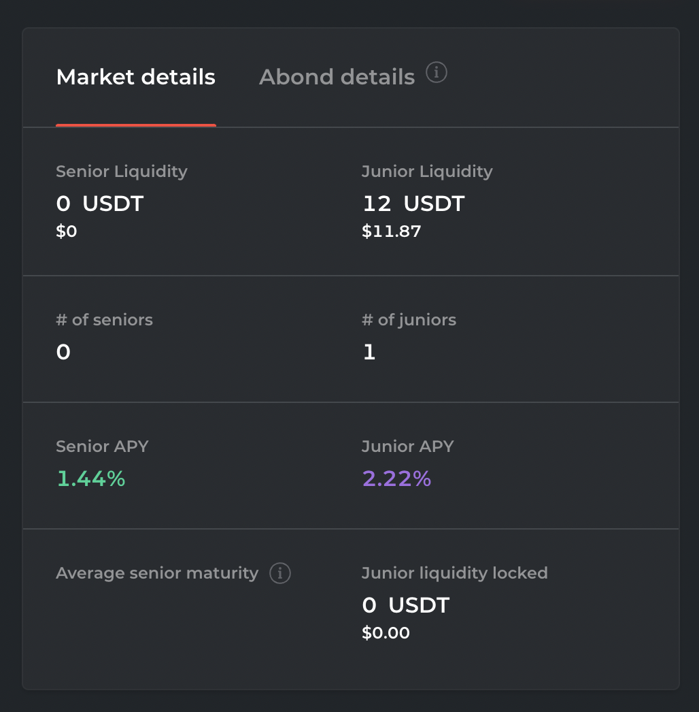
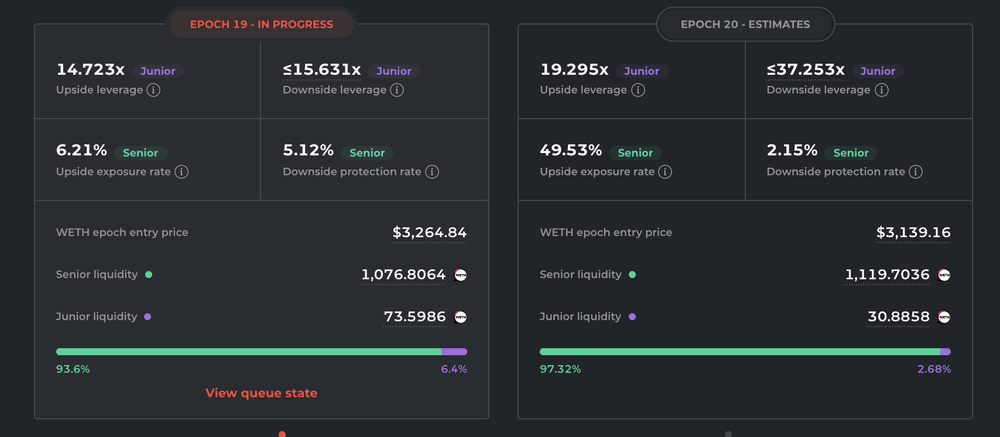

# Bond information

## Purpose

The purpose of bond information is to display to the user necessary information regarding the bond.

## Implementation

The bond information will be displayed in a panel.

### Information to display

#### Issuer

- Description: The name of the issuing organization provided by auction creator
- Value: string
  - Ex: Uniswap

#### Interest rate

- Description: The interest rate
- Value: percent
  - Ex: 8%

#### Bond term length

- Description: Amount of time from the issuance event until the bond matures.
- Value: months
  - Ex: 12 months

#### Maturity date

- Description: Date the bond matures.
- Value: date
  - Ex: Jan 19, 2023

#### Borrowed amount

- Description: The amount of asset borrowed
- Value: amount and type of asset
  - Ex: 15,000,000 FEI

#### Bond value

- Description: The value of bond assuming a linear increase in value to maturity
- Value: amount and type of asset
  - Ex: 15,521,420 FEI

#### Bond collateral

- Description: Type and amount of asset being provided as collateral for bond issuance.
- Value: number and type of asset
  - Ex: 500,000 UNI

#### Current token price

- Description: The current price of the asset provided as collateral in terms of the borrowed asset
- Value: number and type of asset
  - Ex: 25 FEI

#### Bond collateral value

- Description: The current value of the collateral in terms of the borrowed asset
- Value: number and type of asset
  - 12,500,000 FEI

#### Current collateralization ratio

- Description: Calculated by dividing value of collateral offered by current bond value.
- Value: percent
  - Ex: 50%

#### Convertible asset amount

- Description: The amount of collateral asset the bonds are convertible into
- Value: number and type of asset
  - Ex: 300,000 UNI

#### Breakeven token price of convertibility

- Description: The price a token has to be in order for bond redemption to be break-even
- Value: number and type of asset
  - Ex: 75 FEI

## Example

### Barnbridge

