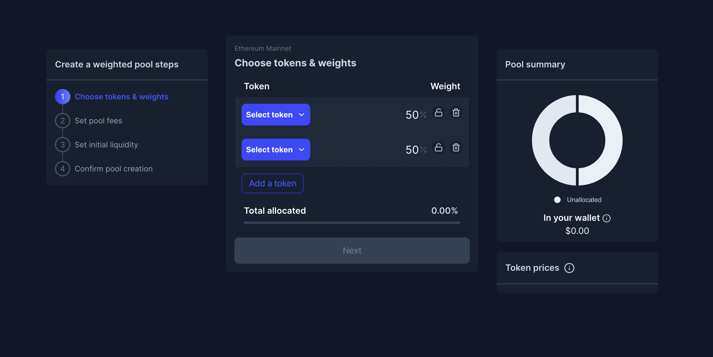

# Offering creation page

## Purpose

The purpose of the offering creation page is to allow product creators to enter the necessary inputs for a product offering and create it.

## Implementation

The page is implemented as a wizard with a main panel and sidebar displaying where the user is in the creation flow.

## Users

- Issuer
  - Product creator/manager

## User flows

## User needs

| User            | User Wants                                                  | Product Needs                     |
| --------------- | ----------------------------------------------------------- | --------------------------------- |
| Product creator | Wants to determine what the steps are to create an offering | Needs wizard to communicate steps |
|                 | Wants to completely understand the data they are entering   | Needs tooltips to clarify inputs  |

## Stages

Wizard should not show until an offering type is selected

1. [Choose offering type](features/offering_type.md)
2. Go through offering wizard
   1. [Auction](features/auction/README.md)
   2. [OTC](features/otc/README.md)

## Examples

### Balancer

