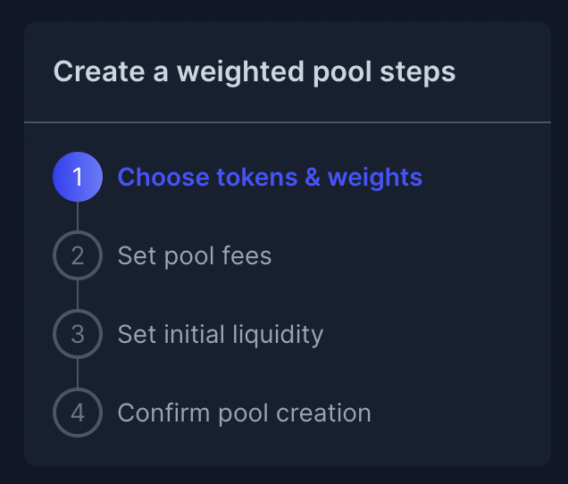

# Auction offering creation

## Purpose

The purpose of the Auction steps is to allow the user to supply all the auction config details.

## Implementation

Auction config is made up of multiple sub steps in the offering creation page and shows up after "Auction" is chosen as the offering to create.

Sub steps are shown in the wizard

## Sub steps

### [Select product](steps.md###Product)

### [Configure offering](steps.md###Bidding)

### [Schedule offering](steps.md###Schedule)

### [Confirm creation](steps.md###Confirm-creation)
