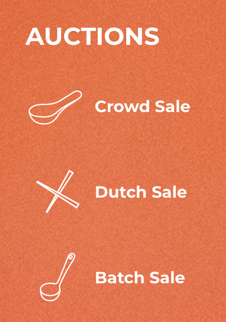
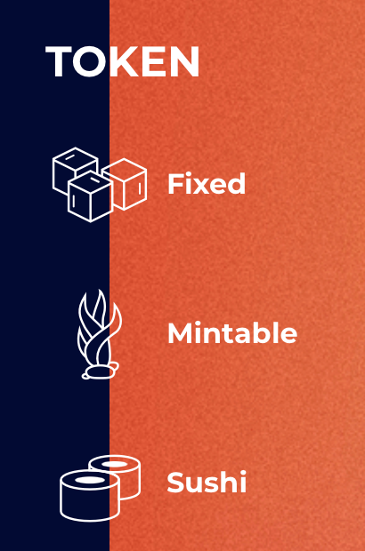
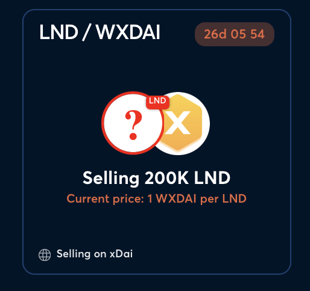
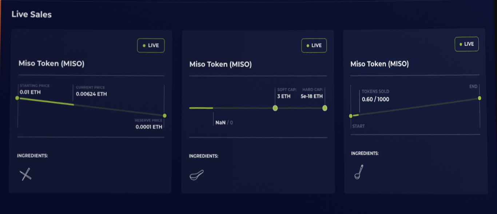

# Offering list

## Purpose

The purpose of the offering list is to allow a user to discover offerings.

## Implementation

Lists will be implemented as a table or a bunch of panels. We can allow users to switch between both views.

### Headers/Panel info

#### **Issuer**

- Description: This is the issuer of the product
- Value: image and name of org and product name as subline
  - Ex:
    - Above: 🦄 Uniswap
    - Below: UNISWAP CONVERT 24AUG2022 USDC

#### **Offering type**

- Description: This is the type of offering
- Value: type and/or icon
  - Ex: 🤝 Auction
  - Ex: 🏷️ OTC

Example of how Sushi Miso uses different icons for different types of auctions [here](https://instantmiso.com)

#### **Product type**

- Description: Product type
- Value: enum + logo
  - ⏩ Convert
  - ⏹️ Simple

Example of how Sushi Miso uses different icons for different product types [here](https://instantmiso.com)

#### **Offering size**

- Description: This is the amount of bonds the issuer is selling
- Value: amount
  - Ex: 50,000,000

#### **Maturity date**

- Description: Bond maturity date
- Value: date time
  - Ex: 23 AUG 2022

#### **Interest rate**

- Description: Depends on auction state
  - Live: The interest rate that would be used if the auction were to end now
  - Ended: The interest rate that was set in the auction
- Value: percent
  - Ex: 12% APY

#### **Price**

- Description: Depends on auction state
  - Live: The price that would be used if the auction were to end now
  - Ended: The price that was set in the auction
- Value: number
  - Ex: 0.88 USDC

#### **Offering status**

- Description: The current status of the offering
- Value: Depends on offering state
  - Examples:
    - Live
      - 
    - Ended

## Examples

### Gnosis auction

### Sushi

