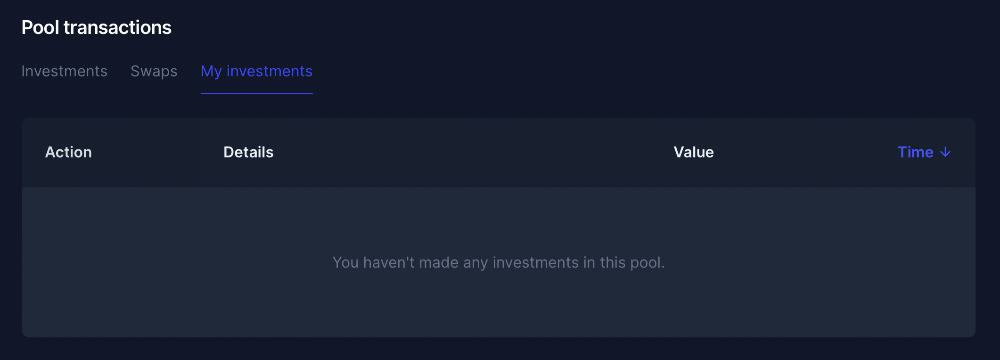

# Orderbook

## Purpose

The purpose of the orderbook is to display all the bids submitted during the auction.

## States

- Active
  - Auction is ongoing
- Ended
  - Auction has ended

## Implementation

The orderbook will be a table with headers at the top and each order represented by a row. Each column will be sortable.

There should be a second tab named "my orders" that allows the user to see their orders. [User orders](user_orders.md)

### Headers

#### Status

- Description: Status of order
- Value: enum
  - Ex: Active

#### Price

- Description: The bond price submitted as part of the bid.
- Value: amount and type of asset
  - Ex: 0.875 USDC

#### Interest rate

- Description: The interest rate submitted as part of the bid.
- Value: percent
  - Ex: 13%

#### Amount

- Description: The size of the bid
- Value: amount and type of asset
  - Ex: 750,000 USDC

#### Transaction

- Description: Link to transaction on etherscan
- Value: icon
  - External link icon (etherscan link)

## Examples

### Gnosis Auction

### Copper Launch

### Balancer

