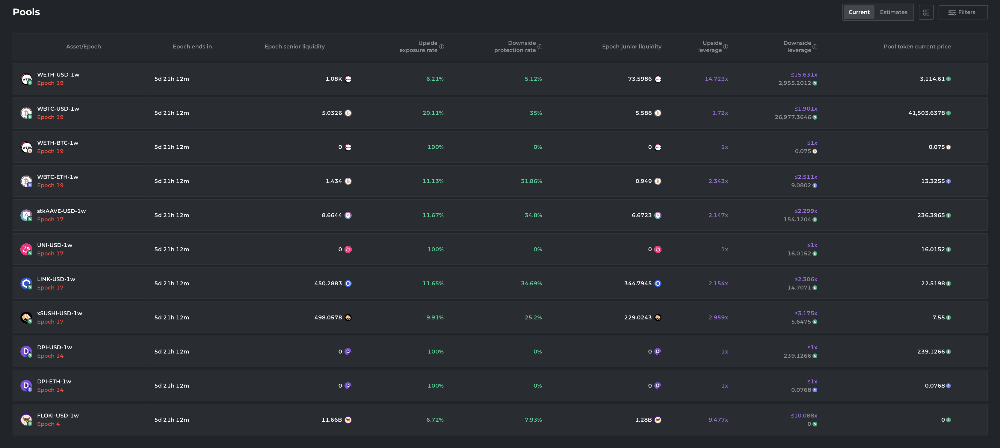

# Portfolio page

## Purpose

The purpose of the portfolio page is to display a user's purchased bonds and communicate their status. The page is also used for management of bonds, including redeeming them at maturity or converting them into collateral.

## Users

- Investor
  - Past auction participant

## User flows

## User needs

| User     | User Wants         | Product Needs                                                                   |
| -------- | ------------------ | ------------------------------------------------------------------------------- |
| Investor | To see their bonds | Display each bond the user has in their wallet along with details for each bond |

## Features

Information we have to display

### [Bond list](features/bond_list.md)

## Examples

### Barnbridge

