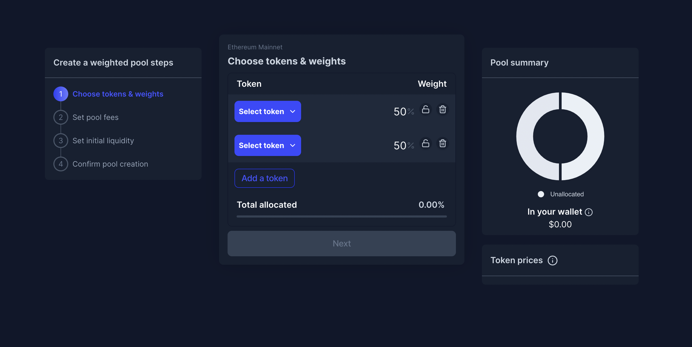

# Product creation page

## Purpose

The purpose of the create product page is to allow the user to enter the necessary inputs for a product and create it.

## Implementation

The page is implemented as a wizard with a main panel and sidebar displaying where the user is in the creation flow.

## Users

- Issuer
  - Product creator

## User flows

## User needs

| User   | User Wants                                                | Product Needs                     |
| ------ | --------------------------------------------------------- | --------------------------------- |
| Issuer | Wants to determine what the steps are to issue a bond     | Needs wizard to communicate steps |
|        | Wants to completely understand the data they are entering | Needs tooltips to clarify inputs  |

## Stages

Wizard should not show until a product type is selected

1. [Choose product type](features/product_type.md)
2. Go through product wizard
   1. [Convert](features/convert/README.md)
   2. [Simple](features/simple/README.md)
   3. Refi (not available yet)

## Examples

### Balancer

