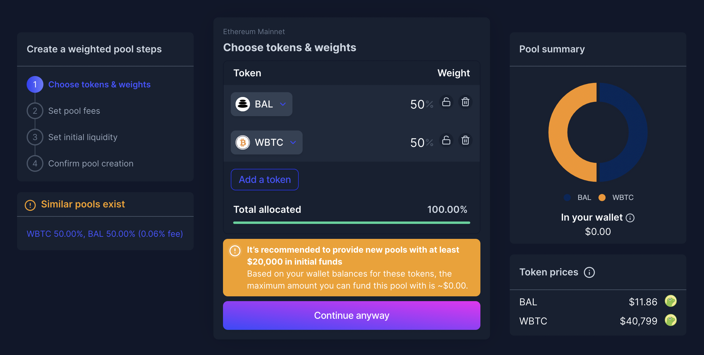

# Convert steps

## Purpose

The purpose of the Convert steps is to allow the user to supply all the product config details.

## Implementation

Multiple sub steps are listed here that can be used in different product wizards.

Sub steps are shown in the wizard

## Sub steps

### Setup product

**inputs**

- Borrow token
  - This is the token the bond is denominated in. It's the token that will be owed at maturity.
  - Should allow users to search tokens
    - Only allow users to find/choose stablecoins
- Supply
  - This is the number of bonds created and the amount of "Borrow token" that will be owed at maturity.
- Bond maturity date
  - This is the date the bond needs to be paid the "Supply" of "Borrow token" by.

### Choose collateral

**inputs**

- Collateral token
  - This is the token that will be used as collateral
  - Should allow users to search tokens
    
  - Can enter a contract address
  - Should accept type and amount

**display**

- Collateral token logo
- Collateral token ticker
- Collateral token balance
- Collateral token price
- Current value of collateral

**example**

### Set convertibility

**inputs**

- Amount of token that is convertible
  - Accepts amount

**display**

- Convertible token logo
- Convertible token ticker
- Convertible token price
- Current value of convertible token

### Confirm creation

**inputs**

- Approve button
  - 
  - Need a step to approve collateral collateral asset

**display**

- Collateral token
  - If convert, show convertibility as well
  - 
- Description
  - Allows user to write a paragraph about the offering

* Summary
  - Symbol
  - Name
  - Supply
  - Maturity date
  - Product type
    - Convert
  - 
