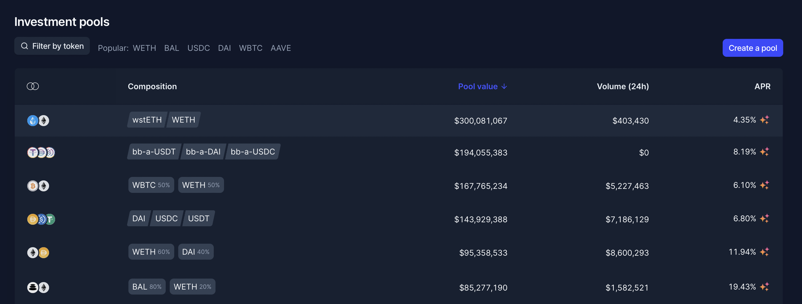

# Product list

## Purpose

The purpose of the product list is to allow a user to discover products.

## Implementation

Lists will be implemented as a table.

### Headers

#### Issuer

- Description: This is the issuer of the product
- Value: image and name of org and product name as subline
  - Ex:
    - Above: 🦄 Uniswap
    - Below: UNISWAP CONVERT 24AUG2022 USDC

#### **Type**

- Description: Product type
- Value: enum + logo
  - ⏩ Convert
  - ⏹️ Simple

#### **Supply**

- Description: This is the amount of bonds issued
- Value: amount
  - Ex: 50,000,000

#### **Maturity date**

- Description: Bond maturity date
- Value: date time
  - Ex: 23 AUG 2022

#### **Status**

- Description: What status is the bond?
- Value: enum
  - Active
  - Matured

## Examples

### Copper Launch

### Balancer

