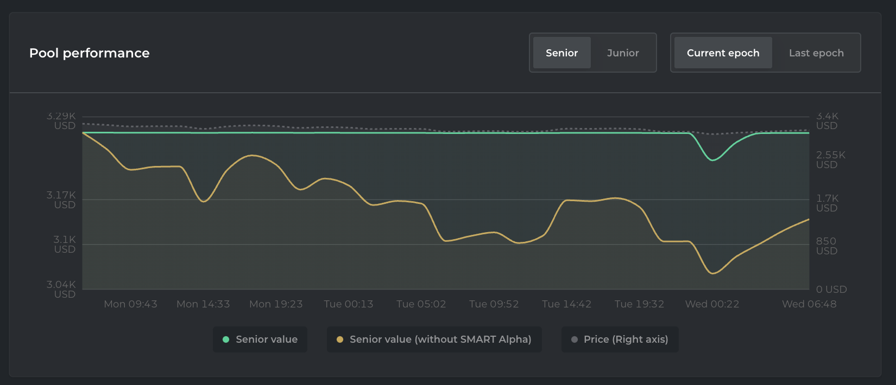
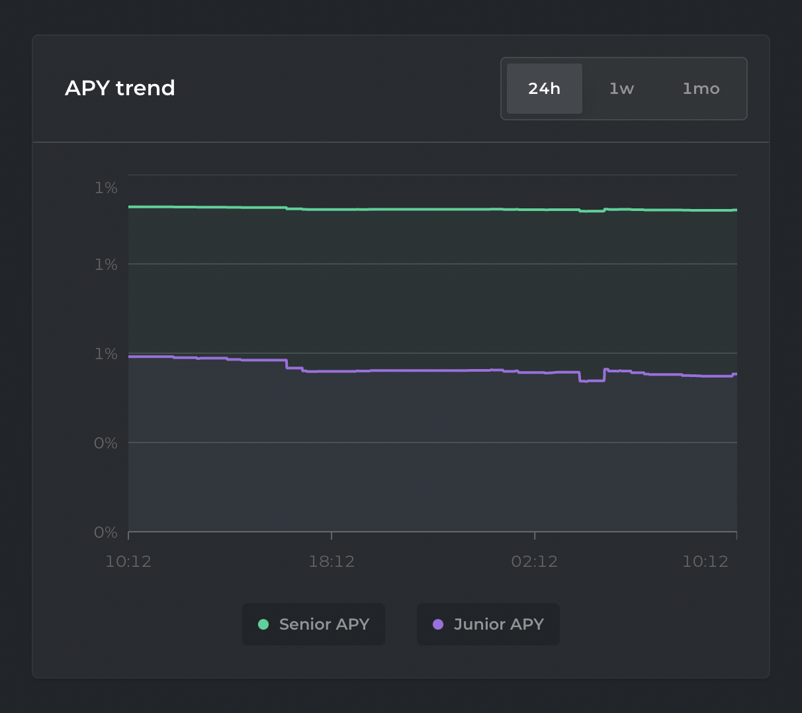

# Convert graph

## Purpose

The purpose of the convert graph is to show the user the current and historical prices that are relevant to their Convert product. It should help investors decide whether it's a good idea to redeem their Converts for tokens.

## Implementation

The Convert graph will be a graph with each line representing a different piece of pricing information.

### Lines

The values are for the whole Convert issuance, not just the user's bonds. The y-axis is the borrowed currency and the x-axis is time.

#### Amount owed

- Description: This line shows the amount owed

#### Collateral value

- Description: This line shows the value of the collateral

#### Convertible token value

- Description: This line shows the convertible token value

#### Price (to be added in the future)

- Description: This line shows the current market value of the Convert

## Examples

### Barnbridge

