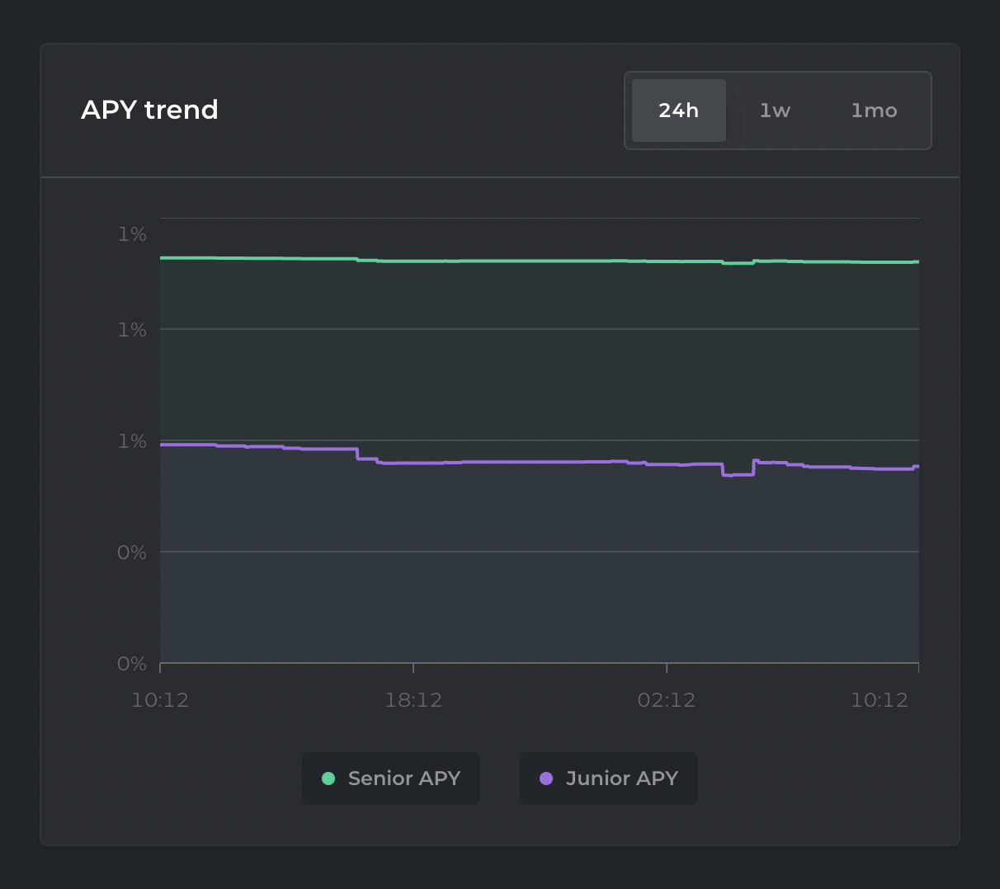

# Graph

## Purpose

The purpose of the graph is to show the user the current and historical prices that are relevant to their Simple product.

## Implementation

The graph will be a graph with each line representing a different piece of pricing information.

### Lines

The values are for one bond. The y-axis is the borrowed currency and the x-axis is time.

#### Amount owed

- Description: This line shows the amount owed. Should be a flat line at a y-axis value of 1

#### Collateral value

- Description: This line shows the value of the collateral per bond

#### Price (to be added in the future)

- Description: This line shows the current market value of the Simple

## Examples

### Barnbridge

