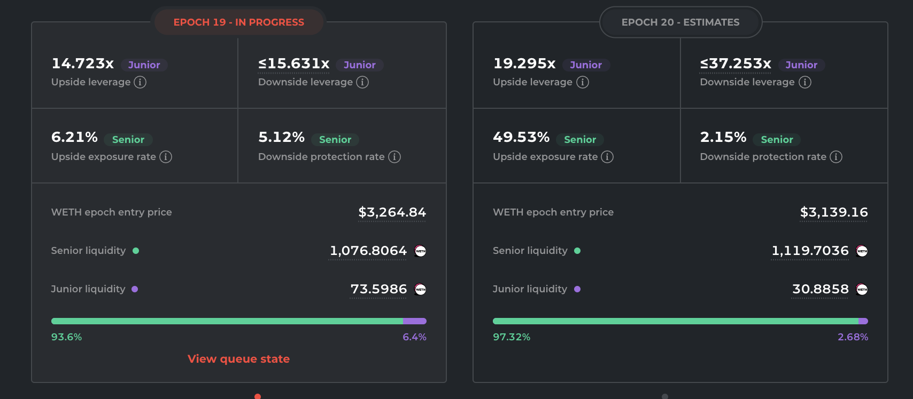

# Simple information

## Purpose

The purpose of Convert information is to display to the user necessary information regarding the bond.

## Implementation

The Convert information will be displayed in a panel.

### Information to display

#### Type

- Description: Product type
- Value: enum + logo
  - 🟧 Simple

#### Name and address

- Description: The logo and name of the Simple token. Next to the name should be a link to the contract on etherscan
- Value: 🦄 Uniswap Simple

#### Supply

- Description: This is the amount of bonds issued
- Value: amount
  - Ex: 50,000,000

#### Maturity date

- Description: Date the bond matures.
- Value: date
  - Ex: Jan 19, 2023

#### Collateral

- Description: Type and amount of asset being provided as collateral for issuance
- Value: numbers and types of asset
  - Ex: 500,000 UNI

#### Current token prices

- Description: The current price of the asset provided as collateral in terms of the borrowed asset
- Value: numbers and types of asset
  - Ex: UNI - 25.93 USDC

#### Collateral value

- Description: The current value of the collateral in terms of the borrowed asset. This number comes from multiplying bond collateral by current token price
- Value: numbers and types of asset
  - 12,500,000 USDC

#### Collateralization ratio

- Description: Calculated by dividing value of collateral offered by bonds issued.
- Value: percent
  - Ex: 350%

## Example

### Barnbridge

