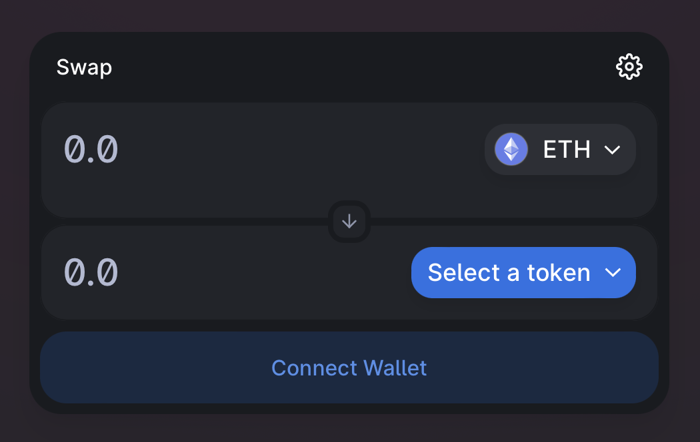

# Redeem panel

## Purpose

The purpose of the redeem panel is to allow users to redeem bonds for funds after the maturity date.

## States

- Before maturity
  - Empty state
- After maturity
  - No default
    - Users can redeem their bonds for principle + interest in borrowed asset after maturity
  - Default
    - Users can redeem their bonds for any payments made in borrowed asset and collateral after maturity

## Implementation

The redeem panel will be implemented as a panel.

### Redeem panel

#### Information

- Status
  - Repaid
  - Partially repaid
  - Defaulted
- Balance
  - Description: Amount of bonds in connected wallet
  - Value: number
    - Ex: 100,000 UNI SIMPLE 22AUG2022 2P USDC
- Amount of bonds to redeem
  - Description: Amount of bonds user redeems
  - Value: number
    - Ex: 100,000 UNI SIMPLE 22AUG2022 2P USDC
- Amount of assets to receive
  - Description: Amount of borrowed asset and collateral available for redemption
  - Value: amount and type of assets
    - States:
      - Repaid
        - Only show borrowed asset (USDC)
          - Ex: 100,000 USDC
      - Partially repaid
        - Show borrowed asset (USDC) and collateral asset (UNI)
          - Ex: 50,000 USDC and 25,000 UNI
      - Defaulted
        - Only show collateral asset (UNI)
          - Ex: 50,000 UNI

#### Inputs

- Redeem button
- Max button
  - Increases "Amount of bonds to redeem" to "Balance"

## Examples

### Uniswap

